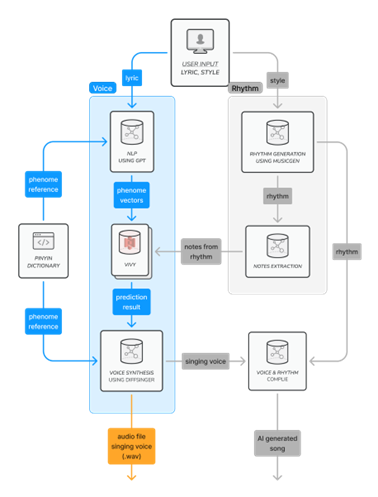

# Text To Song Generative System - Project "Vivy"
 [*Project Report*](./docs/ECE4424_CS4824%20Project%20Report.pdf)  

## Introduction
In recent years, artificial intelligence has made significant strides in various domains, such as chatbot, self-driving, image generation, and music generation. However, in the field of art, especially in music, there is no generative model or multi-model system in research that can produce complete music from text. To accelerate the application of AI in the field of music, and to attempt to use AI to generate a complete piece of music, a text-to-song generative system is proposed in this paper.   
In the project, the aim was to develop a complete text-to-song system where users can input lyrics, song style, BPM, and other information to obtain a fully AI-generated, complete piece of music with synthesized singing voice. This is to further accelerate the application of AI in the field of art. This novel project has not been implemented so far, thus was one of the reasons the project was chosen. Other reasons were to allow people who were previously unable to create music due to any lack of knowledge or skills can make the music they now desire. This would help accelerate new music and possible genres in the music industry due to the ease of making of music.  
Due to the substantial complexity of this project and time constraints during the development process in this project, only the voice generation part of the project was able to be built. The rhythm generation and the creation of complete music will be implemented in the future.  
  

## Features
- **Vivy Models**: Developed a text to Diffsinger file model that can automatically predict the lyric input.
- **Vocal Synthesis**: Using DiffSinger to generate vocal.

## Getting Started
### Prerequisites
- Python 3.8 or later
- Dependencies listed in `requirements.txt`

### Installation
1. Clone the repository:
```
git clone https://github.com/nikmomo/Song-Generation-Model-with-Vocal-Project-Vivy.git
```

2. Install required packages:
```
pip install -r requirements.txt
```

### Usage
- **data**: All collected data are stores here.
- **DiffSinger**: State of art voice synthesis model.
- **predictions**: Example outputs.
- **lyric_data_processing.ipynb**: Process all data and provide *filtered dataset* and *normalzied dataset*.
    - *normalized_output.csv*: Normalized output file that used for training and validating the models.
    - *output.csv*: Dataset with filtered and aligned data.
- **model_training_LSTM.ipynb**: Training the model using LSTM.
- **model_training_GRU.ipynb**: Training the model using GRU.
- **model_training_Transformer.ipynb**: Training the model using Transformer.
- **musicgen_dmeo.ipynb**: MusicGen demo from audioCraft.
- **note_token_to_int.json**: The dictionary to convert notes to integers embedded format.
- **ph_token_to_int.json**: The dictionary to convert phoneme to integers embedded format.
- **note_scaler.pkl**: Scaling notes using MinMaxScaler.


## Examples
Predicting the result with input *Never gonna give you up, never gonna let you down.*  
See `predictions` for the prediction result

## License
This project is licensed under the MIT License - see the `LICENSE` file for details.
